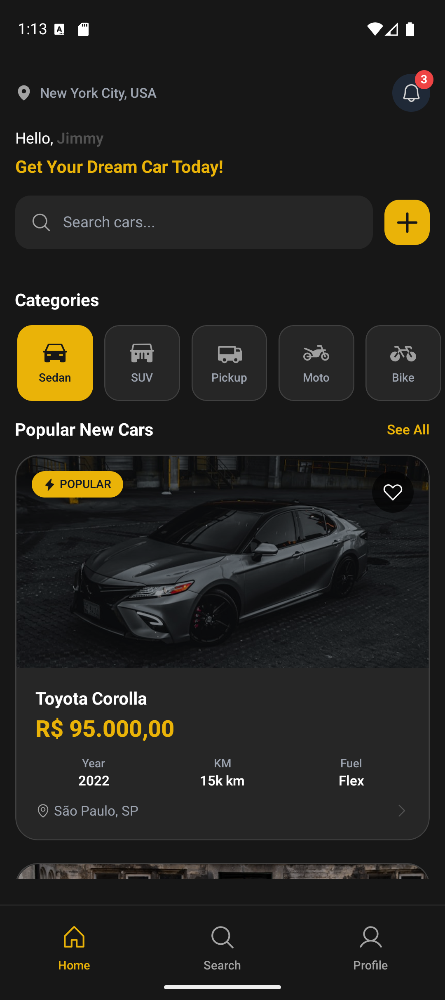
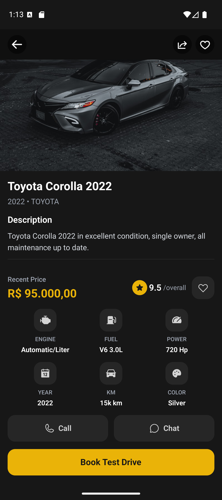
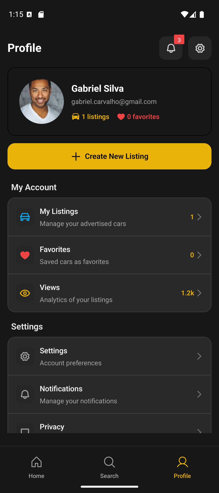
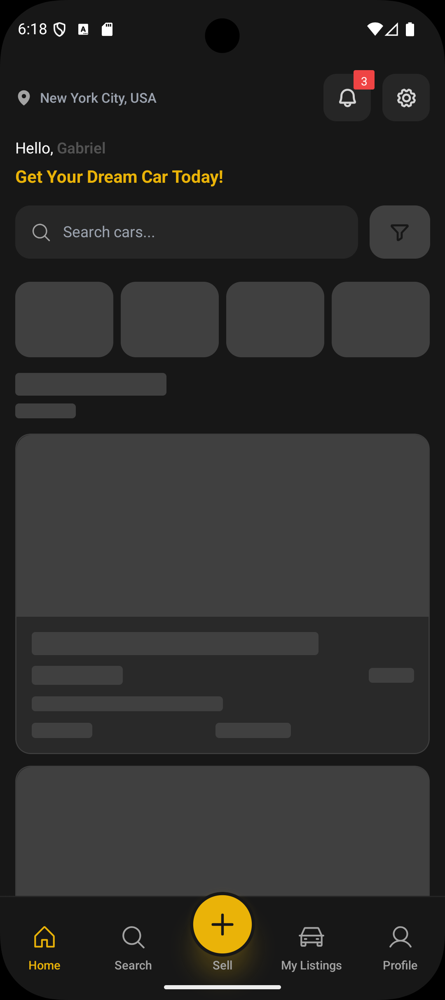
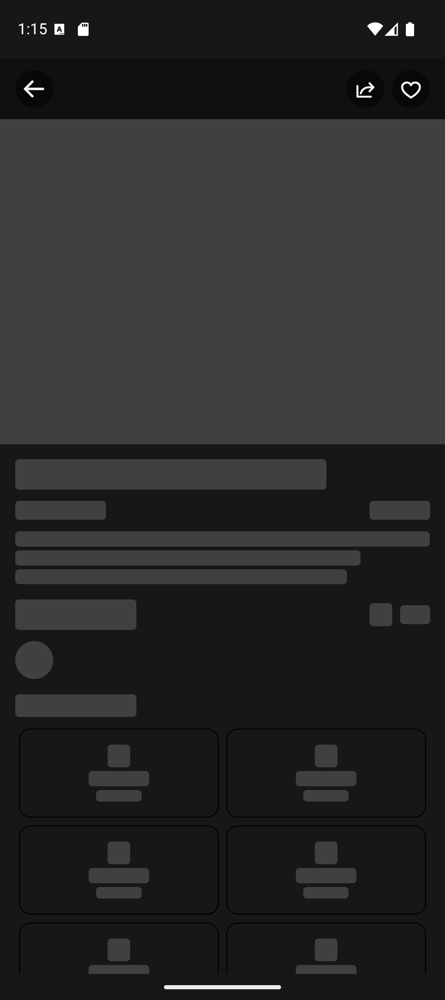
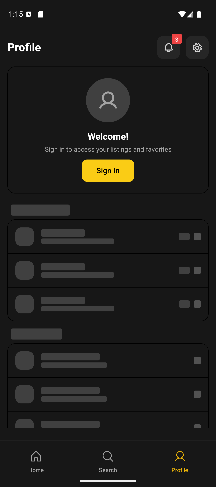

# 🚗 Car Hub - Marketplace de Carros

Um aplicativo moderno de compra e venda de carros desenvolvido com React Native, Expo e Gluestack UI.

## 📱 Visão Geral

Car Hub é uma plataforma completa para o mercado automotivo, oferecendo uma experiência intuitiva tanto para compradores quanto vendedores de veículos. O app combina design moderno, performance otimizada e uma arquitetura escalável.

## 📱 Screenshots

<div align="center">

### 🏠 Tela Principal, Detalhes & Perfil




*Tela inicial com catálogo de carros, perfil do usuário logado e estado de visitante*

### 🚗 Estados de Loading




*Tela de detalhes com especificações completas e skeletons de loading*

### 🎯 Destaques das Screenshots

- **Design Consistente**: Interface dark mode com tokens de cor centralizados
- **Estados de Loading**: Skeletons animados para melhor UX
- **Navegação Intuitiva**: Bottom tabs com ícones Phosphor
- **Dados Realistas**: Mock data com informações brasileiras autênticas
- **Responsividade**: Layout adaptado para diferentes tamanhos de tela
- **Feedback Visual**: Toasts, badges e indicadores de estado

</div>

## ✨ Funcionalidades Implementadas

### 🏠 Tela Principal (Home)
- **Catálogo de Carros**: Lista com dados mock de 10+ veículos diversos
- **Sistema de Favoritos**: Adicione/remova carros dos favoritos com persistência
- **Categorias**: Navegue por diferentes tipos de veículos
- **Pull to Refresh**: Atualize a lista com gesture nativo
- **Infinite Scroll**: Carregamento automático de mais itens

### 🔍 Busca e Filtros
- **Busca por Texto**: Pesquise por título, marca, modelo ou descrição
- **Filtros Básicos**: Por marca, modelo, preço e outras especificações
- **Tela de Busca**: Interface dedicada para explorar o catálogo

### 🚗 Detalhes do Carro
- **Galeria de Imagens**: Visualização profissional com múltiplas fotos
- **Especificações Completas**: Motor, combustível, câmbio, quilometragem
- **Informações do Vendedor**: Perfil com avaliações e contato
- **Botões de Ação**: Ligar, WhatsApp e agendamento de test drive
- **Sistema de Favoritos**: Adicione aos favoritos diretamente na tela

### 👤 Perfil do Usuário
- **Autenticação Mock**: Sistema de login/registro simulado
- **Estatísticas**: Contador de anúncios e favoritos
- **Menu de Navegação**: Acesso a diferentes seções do app
- **Estado Não Logado**: Interface para visitantes com call-to-action

### 🎨 Experiência do Usuário
- **Design System**: Tokens de cor centralizados e componentes consistentes  
- **Modo Escuro**: Interface otimizada para baixa luminosidade
- **Animações Suaves**: Transições fluidas com Reanimated
- **Toasts e Feedback**: Notificações visuais para ações do usuário
- **Modais Responsivos**: Sistema de modais para confirmações e informações

## 🛠️ Stack Tecnológica

### Frontend
- **React Native** - Framework mobile multiplataforma
- **Expo** - Plataforma de desenvolvimento e deploy
- **TypeScript** - Tipagem estática para maior confiabilidade
- **Gluestack UI v2** - Sistema de componentes moderno
- **Tailwind CSS** - Estilização utilitária

### Gerenciamento de Estado
- **Zustand** - State management para favoritos, auth, filtros e modais
- **React Query** - Cache e sincronização de dados das APIs mock
- **AsyncStorage** - Persistência de favoritos e estado de autenticação

### Navegação e Roteamento
- **Expo Router** - Roteamento baseado em arquivos
- **Stack Navigation** - Navegação hierárquica
- **Tab Navigation** - Navegação principal por abas

### Desenvolvimento
- **TypeScript Strict** - Tipagem rigorosa sem `any`
- **Phosphor React Native** - Biblioteca de ícones consistente
- **Yarn** - Gerenciador de pacotes exclusivo
- **Expo Dev Tools** - Hot reload e debugging

## 🏗️ Arquitetura

### Padrão Controller
```
src/app/                 # Screens (UI apenas)
src/controllers/         # Lógica de negócio
src/services/           # APIs e integração
```

### Estrutura de Pastas
```
car-hub/
├── src/
│   ├── app/                 # Telas (Expo Router)
│   │   ├── (tabs)/         # Navegação principal
│   │   ├── auth/           # Autenticação
│   │   └── car/            # Detalhes do carro
│   ├── components/         # Componentes reutilizáveis
│   │   ├── ui/             # Componentes de interface
│   │   └── Modal/          # Sistema de modais
│   ├── controllers/        # Hooks de lógica de negócio
│   ├── services/           # APIs e dados mock
│   ├── store/              # Stores Zustand
│   ├── theme/              # Design tokens
│   ├── types/              # Tipos TypeScript
│   └── utils/              # Utilitários
├── assets/                 # Recursos estáticos
└── docs/                   # Documentação
```

## 🎨 Design System

### Tokens de Design
- **Cores**: Paleta consistente com variações e transparências
- **Tipografia**: Hierarquia clara e legível
- **Espaçamento**: Sistema base-8 para consistência
- **Bordas**: Raios padronizados para elementos

### Componentes
- **Gluestack UI**: Base sólida e acessível
- **Componentes Customizados**: Específicos do domínio automotivo
- **Sistema de Ícones**: Phosphor React Native

## 🚀 Instalação e Execução

### Pré-requisitos
- Node.js 18+ 
- Yarn
- Expo CLI
- Android Studio ou Xcode (para emuladores)

### Setup do Projeto
```bash
# Clone o repositório
git clone https://github.com/GCLDEV/car-hub.git
cd car-hub

# Instale as dependências
yarn install

# Inicie o servidor de desenvolvimento
yarn start

# Para plataformas específicas
yarn android
yarn ios
```

### Comandos Disponíveis
```bash
yarn start          # Inicia o servidor Expo
yarn android        # Executa no Android
yarn ios           # Executa no iOS
yarn web           # Executa no navegador
yarn lint          # Verifica código
yarn type-check    # Verifica tipos TypeScript
```

## 📊 Dados e API

### Sistema Mock
O projeto utiliza um sistema robusto de dados mock para desenvolvimento:

- **10+ Carros Diversos**: Diferentes marcas, modelos e preços
- **Vendedores Realistas**: Perfis completos com avaliações
- **Localização Brasileira**: Cidades e estados reais
- **Imagens Profissionais**: Via Unsplash com alta qualidade

### Estrutura de Dados
```typescript
interface Car {
  id: string
  title: string
  brand: string
  model: string
  year: number
  price: number
  km: number
  fuelType: FuelType
  transmission: TransmissionType
  color: string
  description: string
  images: string[]
  location: string
  features: string[]
  specs: CarSpecs
  seller: Seller
}
```

## 🔐 Sistema de Autenticação

- **Login/Registro Mock**: Simulação completa de autenticação
- **Persistência de Sessão**: Estado mantido entre sessões
- **Validação de Formulários**: Validação client-side rigorosa
- **Feedback Visual**: Toasts para sucesso/erro nas operações

## 📱 Compatibilidade

### Plataformas Suportadas
- ✅ Android 5.0+ (API 21+)
- ✅ iOS 11.0+
- ✅ Web (Expo Web)

### Dispositivos Testados
- Smartphones (4" - 7")
- Tablets (8" - 13")
- Navegadores modernos

## 🧪 Qualidade e Desenvolvimento

### Padrões de Código
- **TypeScript Strict**: Tipagem rigorosa em todo o projeto
- **Padrão Controller**: Separação clara entre UI e lógica de negócio
- **Component Architecture**: Gluestack UI + componentes customizados
- **Design Tokens**: Sistema centralizado de cores e espaçamentos

### Debugging e Desenvolvimento
- **Console Logs**: Removidos para produção
- **Expo Dev Tools**: Hot reload e debugging avançado
- **Error Boundaries**: Tratamento robusto de erros
- **Toast System**: Feedback visual consistente

## 🚀 Desenvolvimento e Preview

### Ambiente de Desenvolvimento
```bash
# Desenvolvimento local
yarn start

# Preview em dispositivos
yarn android
yarn ios
```

### Funcionalidades em Desenvolvimento
- **Criação de Anúncios**: Tela preparada mas não implementada
- **Chat/Mensagens**: Botões preparados para integração futura
- **Notificações**: Sistema preparado mas simulado
- **Configurações**: Menu criado, funcionalidades por implementar

## 🤝 Contribuição

### Como Contribuir
1. Fork o projeto
2. Crie uma branch para sua feature (`git checkout -b feature/nova-funcionalidade`)
3. Commit suas mudanças (`git commit -m 'feat: adiciona nova funcionalidade'`)
4. Push para a branch (`git push origin feature/nova-funcionalidade`)
5. Abra um Pull Request

### Padrões de Commit
- `feat:` Nova funcionalidade
- `fix:` Correção de bug
- `docs:` Documentação
- `style:` Formatação
- `refactor:` Refatoração
- `test:` Testes
- `chore:` Manutenção

## 📄 Licença

Este projeto está sob a licença MIT. Veja o arquivo [LICENSE](LICENSE) para mais detalhes.

## 👥 Time

- **GCLDEV** - Desenvolvimento Full Stack
- Design inspirado nas melhores práticas do mercado

## 🔗 Links Úteis

- [Expo Documentation](https://docs.expo.dev/)
- [Gluestack UI](https://ui.gluestack.io/)
- [React Navigation](https://reactnavigation.org/)
- [Zustand](https://github.com/pmndrs/zustand)

---

<div align="center">

**🚗 Car Hub - Connecting Car Dreams to Reality**

Made with ❤️ by GCLDEV

</div>